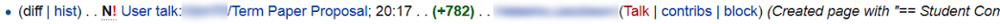
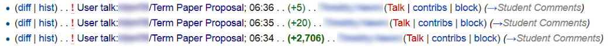
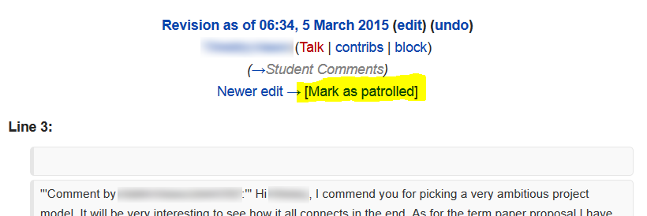

Patrolling Student Comments
================================================================================

On each instructor's personal page (reached by clicking your name in the
top-right corner), there are two links that lead to lists of student comments.

The first is "Comments on course materials".

This page lists any content that students post on Talk pages in the Main
namespace. For example, if a student were to click the "Discussion" link at the
top of the Course Policies page, she could leave comments about the course
policies. This is more relevant to BIOL 373, where we encouraged students to
post concerns or corrections on the unit Talk pages. For BIOL 300, students
generally shouldn't be doing this. However, this link is still worth checking
from time to time, since students may incorrectly post things in this space.

The other link found on instructors' personal pages is
"Comments on term papers".

This page lists any content that students post on Talk pages in the User
namespace. That is, when a student leaves a comment on a benchmark, it will
appear here.

When you are grading comments, you will want to mark them as "patrolled", which
will eliminate them from these lists. There are two ways to mark comments as
patrolled; depending on whether the comment was the first left on the page or
not, you must use one or the other (which is fairly annoying and inconvenient).

If the comment left by a student resulted in the creation of a new Talk page,
i.e., the student was the first individual to leave a comment, then the entry in
the listing will look like this:

Things to take note of:

- Be careful about confusing the author of the comment and the recipient of the
  comment.
- The edit description says "Created page...", indicating that this student was
  the first to leave a comment on this page.
- There is a capital, bold N in front of the page name, which again indicates
  that this edit represents the creation of a new page.
- The word "diff" at the start of the line is not clickable. This is because
  there is no earlier edit to compare this first edit to.

Marking first edits as patrolled works differently than marking subsequent edits
as patrolled. To mark a first edit as patrolled, navigate to the Talk page by
clicking the page name (in this example, "User talk:.../Term Paper Proposal"),
scroll to the very bottom of the page, and click the "Mark this page as
patrolled" link. Doing this will eliminate the first edit entry from the
listing.

Note that when you click on the page name in this way, you will be taken to the
*current* version of the page, so you will see any late edits the student made,
as well as edits made by other students. To disambiguate which edits the
first-edit poster left before or after a deadline, look at the page history.

Subsequent edits made by students to existing User Talk pages appear a little differently:

Things to take note of:

- In this example, the same person performed three consecutive edits on one term
  paper proposal page. This student could have left more later. Each edit will
  need to be marked as patrolled separately. Once you've decided on a score for
  this student's comment, you should scan the list of edits for additional edits
  by the same person to the same benchmark and mark each as patrolled so that
  you do not have to deal with them again.
- The bold N is absent, since the page already existed.
- The "diff" link is clickable because the page already existed.

To mark these edits as patrolled, click a "diff" link and then click "Mark as patrolled" near the top right, beneath the editor's name:

Clicking this will remove that single entry from the edits listing.

Rinse and repeat. By the end of this round of comment grading, the list of
unpatrolled edits should be empty.