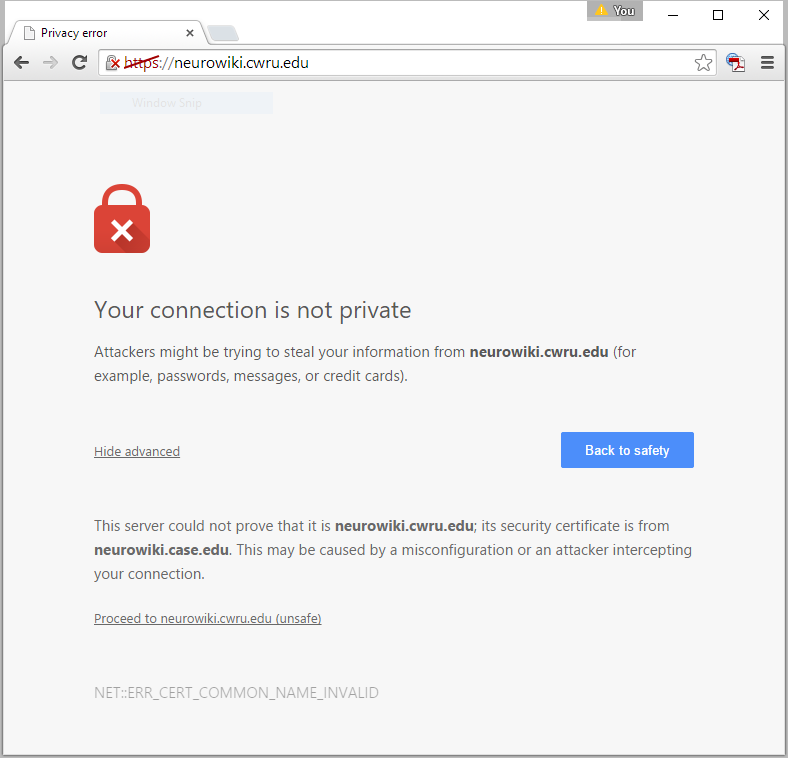

HTTPS & SSL
================================================================================

Web browsers can make insecure (HTTP) or secure (HTTPS) connections to websites.
Since the wiki requires passwords, it should be set up to use HTTPS.

When a web browser tries to create an HTTPS connection with a website, it
requests to see an SSL certificate that proves the server it is talking to is
the real deal. If the server can't provide one that matches the address the web
browser is trying to connect to, the web browser will warn the user that
something is wrong.

For example, although https://neurowiki.cwru.edu is a perfectly valid alias for
https://neurowiki.case.edu, a browser visiting the former should warn the user
that the connection is not secure, preventing them from visiting it unless they
click through some warnings. Here's what Chrome does when I visit that address:

The SSL certificate we obtained from the university for that virtual machine
certifies that our site is ``neurowiki.case.edu``, but not
``neurowiki.cwru.edu``.  Lacking an appropriate SSL certificate does not prevent
people from using the site (i.e., in Chrome, I could click "Proceed to
neurowiki.cwru.edu (unsafe)"), but your visitors will likely be scared away, or
at least inconvenienced, if it's absent.

As described in :doc:`networking-bg`, when a virtual machine is using port
forwarding, it is accessed using an address like
https://dynamicshjc.case.edu:8014. For this reason, the virtual machine needs to
present DynamicsHJC's SSL certificate while it is using port forwarding. When it
is switched to bridged networking, it is accessed at an address like
https://neurowiki.case.edu, so it must present a different SSL certificate. When
the virtual machine is cloned and moved to https://neurowikidev.case.edu, it
must present another different SSL certificate.

Instructions for creating and renewing SSL certificates can be found in
:doc:`ssl-cert`.